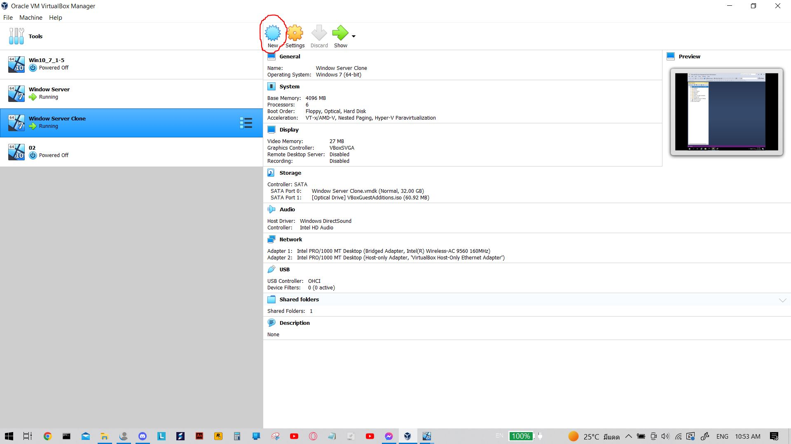
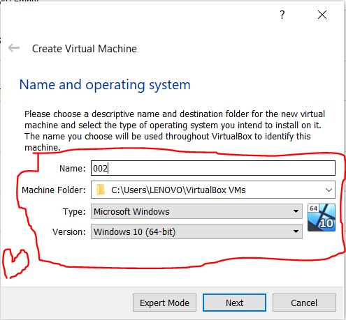
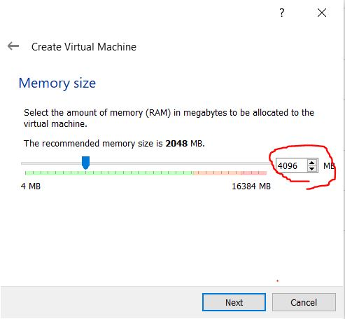
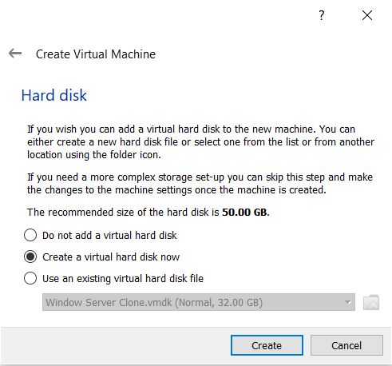

# set up Oracal Vm&#x20;

## Open Oracal VM&#x20;

1.เปิด Oracal VM แล้ว คลิก New&#x20;

<figure><figcaption></figcaption></figure>

2.ตั้งชื่อไฟล์เลือกโฟรเด้อที่จะจัดเก็บ / เลือกรูปแบบของ Window&#x20;

<figure><figcaption></figcaption></figure>

3\. เลือกขนาดแรมที่เราจะให้มัน โดยวิธีหาขนาดคือ 1024 คูณด้วยจำนวนแรมที่เราต้องการ&#x20;

<figure><figcaption></figcaption></figure>

4.เลือก Create a virtual hard disk now จากนั้น กด Create&#x20;

<figure><figcaption></figcaption></figure>

5\. เลือก VMDK จากนั้นกด Next

.png>)

6.กด Next&#x20;

.png>)

7\. เลือก ที่อยู่ไฟล์และขนาดของ ที่เก็บข้อมูลที่เราต้องการ จากนั้นกด Create&#x20;

.png>)

8.กดที่เมนู Start เพื่อเปิดเครื่อง&#x20;
