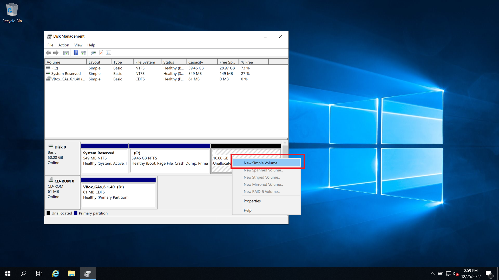

# Disk Management

1.คลิกขวาที่ปุ่ม Windows&#x20;

2.เลือกDisk Management&#x20;

3.จะเข้ามาในหน้าลักษณะนี้

.png>)

4.จากนั้นเลือกคลิกขวา แล้วเลือกคำสั่ง Shink Volum

.png>)

5.จะแสดงหน้าที่ไว้สำหรับเลือกขนาดของไดฟ์ โดยสูตรการคำนวณคือ 1024คูณด้วยขนาดที่เราต้องการเช่น (1024\*5= 5120) ก็จะได้ไดฟ์ตามขนาดที่เราต้องการ  จากนั้นกดที่ปุ่ม Shrink

.png>)

6.จากนั้นเราก็จะได้ไดฟ์ที่เราแบ่งออกมา&#x20;

.png>)

7.จากนั้นให้เราคลิกขวาที่ไดฟ์ที่เราได้มา และเลือกเมนู New Simple Volume

8.จากนั้นให้เรากด Next ไปเรื่อยจนกระทั่งถึงหน้า ตามภาพ ให้เราเลือกชื่อไดฟ์ที่เราต้องการจากนั้นกด Next ต่อ&#x20;

.png>)

9.ให้เรากด Next ต่อไปเรื่อยๆจากนั้นกด Finish เป็นอันเสร็สสิ้น
